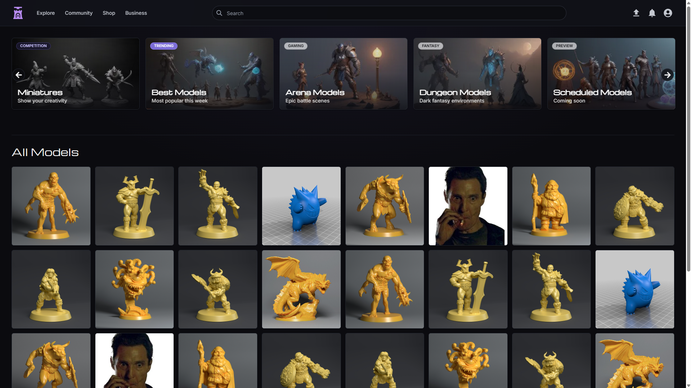
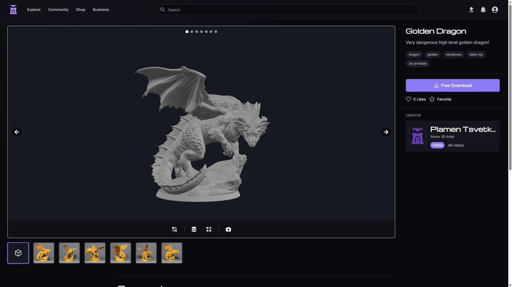
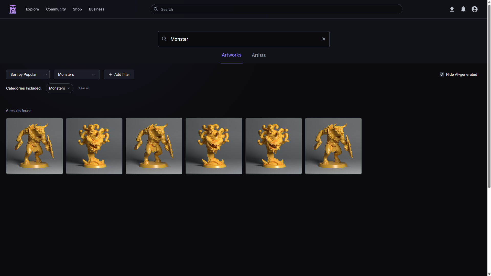
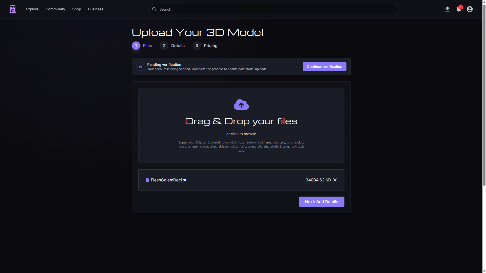
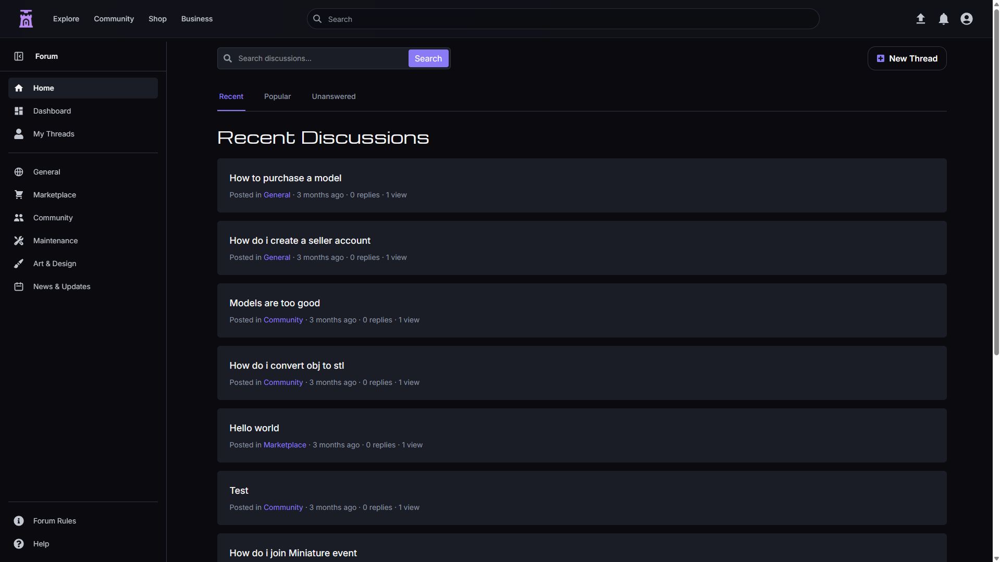
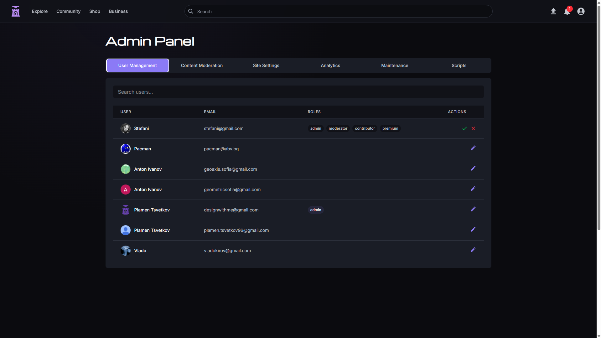
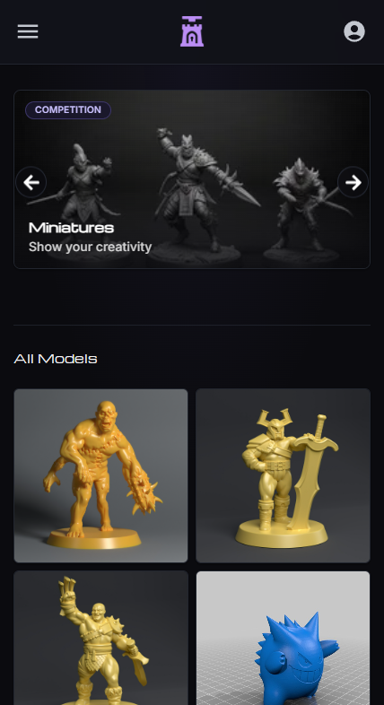
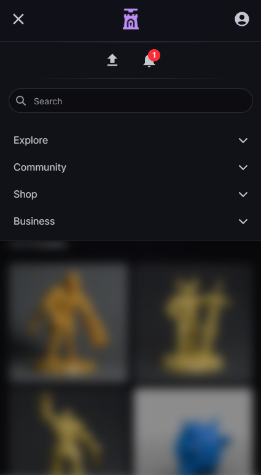
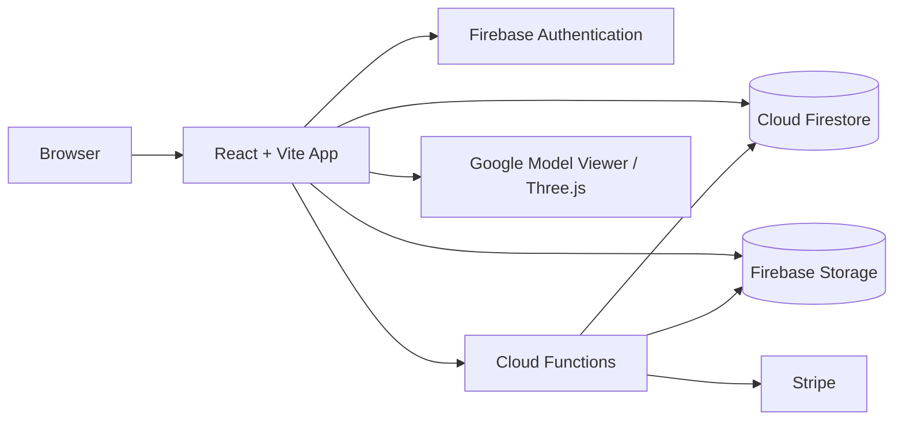

<div align="center">

# 3D Print Dungeon

**A full-stack marketplace and community platform for discovering, uploading, previewing, and selling 3D printable models.**


</div>

<br/>

<p align="center">
  <a href="https://printdungeon.com"><strong>Live URL</strong></a>
  |
  <a href="#features"><strong>Features</strong></a>
  |
  <a href="#product-flow"><strong>Product Flow</strong></a>
  |
  <a href="#architecture"><strong>Architecture</strong></a>
  |
  <a href="#project-status"><strong>Project Status</strong></a>
  |
  <a href="#local-development"><strong>Local Setup</strong></a>
</p>

<br/>

<p align="center">
  
</p>


---

## Overview

3D Print Dungeon is a marketplace and community application built around downloadable 3D-printing assets.

Users can browse and search models, inspect them through an interactive 3D viewer, upload their own files, manage public profiles, interact through likes and follows, participate in forum discussions, and access free or paid content.

The project was developed end to end and combines a React frontend with Firebase Authentication, Firestore, Storage, Cloud Functions, role-based access, Stripe payment flows, and model-processing utilities.

---

## Features

### Marketplace and discovery

- Firestore-backed model browsing with infinite loading
- Model and artist search
- Category, tag, and metadata-based discovery
- Detailed model pages with descriptions, comments, statistics, and creator information
- Free and paid model support
- Public creator profiles
- Likes, follows, favorites, and in-app notifications

### Upload and 3D preview

- Multi-step model upload flow
- File, image, description, category, tag, and pricing inputs
- Firebase Storage uploads
- Interactive previews with Google Model Viewer
- Lazy loading, progress feedback, caching, and fullscreen preview behavior
- Client-side STL and OBJ conversion utilities that generate GLB previews
- Edit and management flows for uploaded models

### Authentication and permissions

- Email/password authentication
- Google sign-in
- Password reset and account settings
- Protected routes
- Role-based access for users, artists, moderators, and administrators
- Firebase custom claims, Firestore rules, Storage rules, and Cloud Function checks for sensitive operations
- Maintenance mode with administrative access

### Payments and seller tools

- Stripe Elements checkout
- PaymentIntent-based purchase flow
- Purchase records and sales data
- Stripe Connect onboarding and account-status checks
- Seller verification checks in paid-upload flows
- Cloud Function-backed payment operations and webhook support

### Community and administration

- Forum categories, threads, replies, editing, and deletion flows
- User notifications
- Administrative dashboard
- User and role management
- Moderation tools
- Marketplace analytics and maintenance controls
- Model view tracking and scheduled analytics processing

---

## Tech Stack

Built with a React and TypeScript frontend, Firebase-managed backend services, Stripe payment workflows, Google Model Viewer previews, and a Vite-based development and production toolchain.

| Area               | Technologies                                       |
| ------------------ | -------------------------------------------------- |
| Frontend           | React 19, TypeScript 5, Vite 6, Tailwind CSS 4     |
| Routing and data   | React Router 7, TanStack Query                     |
| Authentication     | Firebase Authentication                            |
| Database           | Cloud Firestore                                    |
| Storage            | Firebase Storage                                   |
| Serverless backend | Firebase Cloud Functions, Node.js 20               |
| Payments           | Stripe.js, React Stripe.js, Stripe Node SDK        |
| 3D rendering       | Google Model Viewer, Three.js conversion utilities |
| Testing            | Vitest, React Testing Library, jsdom               |
| Delivery           | Firebase Hosting, Docker, Docker Compose, Nginx    |
| App tooling        | ESLint, Vite PWA, compression tooling              |

---

## Product Preview

The hero screenshot is shown above. Additional screenshots are available in `docs/images`.


<p align="center">
  
  
</p>

<p align="center">
  
  
</p>

<p align="center">
  
</p>

<p align="center">
  
  &nbsp;
  
</p>

<!--
If the mobile screenshots feel too tall in the main README, use this compact
collapsible version instead of the visible mobile screenshot block above.

<details>
  <summary><strong>Mobile screenshots</strong></summary>

  <p align="center">
    
    &nbsp;
    
  </p>
</details>
-->

<!--
Optional demo GIF:

Add `docs/images/marketplace-demo.gif`, then uncomment this block.

<p align="center">
  
</p>
-->


## Product Flow

### Discover and inspect a model

1. A user browses or searches Firestore-backed model listings.
2. The model detail page loads metadata, creator information, community activity, and preview assets.
3. Google Model Viewer renders supported preview files with lazy loading and fullscreen controls.
4. Views and selected interactions are processed through Firebase services and Cloud Functions.

### Publish a model

1. An authenticated user selects one or more model files.
2. The uploader collects model details, categories, tags, render images, and pricing information.
3. Paid uploads check seller onboarding status.
4. Original files and images are uploaded to Firebase Storage.
5. STL or OBJ assets can be converted client-side into GLB preview output.
6. Model metadata is stored in Firestore and becomes available through the model page.

### Purchase a paid model

1. The frontend requests payment initialization through a Firebase Cloud Function.
2. Stripe Elements collects and confirms payment information.
3. Serverless functions coordinate Stripe operations and purchase recording.
4. Purchase and seller information is exposed through account and marketplace flows.

> **Commercial-readiness note:** the payment integration is suitable as a portfolio implementation, but paid-file access and server-side purchase validation require additional hardening before handling real commercial transactions.

---

## Architecture

The application uses a feature-oriented React frontend supported by Firebase-managed backend services.

- **React client:** routes, marketplace UI, model preview, upload flows, account pages, forum, and administration
- **Firebase Authentication:** user identity and session handling
- **Cloud Firestore:** models, profiles, marketplace data, forum content, notifications, settings, and transaction records
- **Firebase Storage:** model files, preview assets, and profile media
- **Cloud Functions:** payment operations, roles, likes, follows, analytics, notifications, and administrative tasks
- **Stripe:** checkout and seller-onboarding flows
- **Google Model Viewer and Three.js:** interactive preview and conversion support

<details>
<summary><strong>View architecture details</strong></summary>

### Repository structure

```text
3d-print-dungeon/
|-- src/                    # React application and feature modules
|-- functions/              # Firebase Cloud Functions
|-- public/                 # Static assets, manifest, and SEO files
|-- scripts/                # Sitemap, PWA, and maintenance utilities
|-- __tests__/              # Vitest and React Testing Library files
|-- docs/                   # Project documentation
|-- firestore.rules         # Firestore authorization rules
|-- storage.rules           # Storage authorization rules
|-- firestore.indexes.json  # Firestore indexes
|-- firebase.json           # Hosting, Functions, emulators, rules, extensions
|-- Dockerfile              # Multi-stage frontend production image
|-- docker-compose.yml      # Containerized development/production profiles
`-- nginx.conf              # SPA delivery and production headers
```

### High-level system flow



### Role and access model

Sensitive functionality is protected through several layers:

- Route guards control access to protected frontend pages.
- Firebase custom claims support privileged roles.
- Firestore rules protect private user, payment, settings, and moderation data.
- Storage rules restrict authenticated and owner/admin writes.
- Cloud Functions validate authentication and administrative access for server-side operations.

Role information is currently distributed across custom claims and user/profile documents, so the project describes access as role-based without claiming that every role source is fully unified.

</details>

---

## Engineering Highlights

- **Interactive 3D delivery:** large model assets are loaded through a dedicated preview experience with progress and fallback behavior.
- **Model conversion:** STL and OBJ files can be converted into browser-friendly GLB previews.
- **Serverless feature design:** Cloud Functions handle payment, role, social, notification, analytics, and maintenance workflows.
- **Layered permissions:** client routes, custom claims, database rules, storage rules, and callable functions contribute to access control.
- **Feature-oriented frontend:** routes, services, hooks, providers, and components are organized by application area.
- **Marketplace interactions:** likes, follows, comments, views, purchases, profiles, and notifications connect users and models.
- **Deployment flexibility:** the project supports Firebase Hosting and container-based frontend delivery.

---

## Testing and Quality

The repository includes Vitest, React Testing Library, jsdom, ESLint, TypeScript type checking, Firebase emulators, and production-build validation.

### Current validation status

- [x] Production build completes successfully
- [x] TypeScript type checking passes
- [ ] Linting requires cleanup
- [ ] Existing automated test suites require maintenance and broader coverage
- [ ] Critical auth, upload, payment, and forum flows need additional integration tests

The configured test tooling demonstrates the intended quality workflow, but this README does not claim complete or passing automated coverage.

---

## Deployment

| Component                      | Platform                 |
| ------------------------------ | ------------------------ |
| Frontend hosting               | Firebase Hosting         |
| Database                       | Cloud Firestore          |
| Authentication                 | Firebase Authentication  |
| File storage                   | Firebase Storage         |
| Serverless backend             | Firebase Cloud Functions |
| Payments                       | Stripe                   |
| Alternative frontend packaging | Docker and Nginx         |

**Live deployment:**

- [printdungeon.com](https://printdungeon.com)

Firebase hosting mirrors:

- [print-dungeon-3d.web.app](https://print-dungeon-3d.web.app/)
- [print-dungeon-3d.firebaseapp.com](https://print-dungeon-3d.firebaseapp.com/)

---

## Challenges and Lessons Learned

### Rendering heavy 3D assets

Large printable-model files require deliberate loading, conversion, preview, caching, progress, and fallback behavior to keep the interface usable.

### Coordinating Firebase services

Authentication, Firestore, Storage, Cloud Functions, rules, indexes, extensions, and emulators must work together across local and deployed environments.

### Designing role-based behavior

Marketplace users, artists, moderators, and administrators require different routes, actions, data access, and server-side checks.

### Connecting purchases to digital assets

A paid-model flow involves more than checkout UI: seller onboarding, payment confirmation, purchase records, access control, and protected file delivery must remain consistent.

### Balancing product breadth

The project contains marketplace, community, administration, and business-facing areas. The core flows are implemented, while less important showcase sections remain intentionally identified as prototype or placeholder work.

---

## Project Status

### Implemented

- [x] React and TypeScript application
- [x] Firebase Authentication
- [x] Protected routes and role-based access
- [x] Firestore-backed model browsing
- [x] Model and artist search
- [x] Model detail pages
- [x] Multi-step model upload
- [x] Firebase Storage integration
- [x] Interactive 3D model previews
- [x] STL and OBJ preview conversion
- [x] Free and paid model flows
- [x] Stripe payment interface
- [x] Stripe Connect onboarding support
- [x] Public profiles and account settings
- [x] Likes and follows
- [x] In-app notifications
- [x] Forum threads and replies
- [x] Administrative dashboard
- [x] Maintenance mode
- [x] Firebase Hosting deployment
- [x] Docker and Nginx packaging option

### Implemented with limitations

- [~] Model and artist search - some sorting and pagination behavior needs refinement
- [~] Stripe Connect and paid delivery - implemented as a portfolio flow and requires production hardening
- [~] Forum view tracking - implementation and rule behavior need alignment
- [~] Marketplace landing areas - mixed live and mock content
- [~] Notifications - core UI and storage exist, but some helper types exceed current usage
- [~] Automated tests - tooling exists, but suites require repair and expansion

### Prototype or placeholder areas

- [ ] Events
- [ ] Blog content
- [ ] Collections
- [ ] Printed figures
- [ ] New-arrivals and best-seller marketplace sections

### Recommended next improvements

- [ ] Enforce server-side model pricing during payment creation
- [ ] Protect paid model files behind verified purchase access
- [ ] Repair lint and automated test suites
- [ ] Add integration tests for authentication, uploads, purchases, and forum flows
- [ ] Finish marketplace sorting and pagination
- [ ] Replace mock showcase sections with live data or remove them
- [ ] Consolidate role information and authorization rules
- [ ] Refresh sitemap, robots, routes, and older documentation

---

<details id="local-development">
<summary><strong>Local Development</strong></summary>

### Prerequisites

- Node.js 20 recommended
- npm
- Firebase CLI
- Access to a Firebase project for full backend functionality
- Stripe test credentials for payment flows

### 1. Clone and install

```bash
git clone https://github.com/Killerbeez7/3d-print-dungeon.git
cd 3d-print-dungeon
npm install
```

Install Cloud Function dependencies:

```bash
cd functions
npm install
cd ..
```

### 2. Configuration

The frontend and Functions require Firebase and Stripe configuration.

Verified configuration names include:

```text
VITE_STRIPE_PUBLISHABLE_KEY
STRIPE_SECRET_KEY
STRIPE_WEBHOOK_SECRET
```

Stripe server secrets should be managed through Firebase Secret Manager rather than committed files.

The repository also expects local Firebase project configuration used by `src/config/firebaseConfig.ts`. Never commit private service credentials or production secrets.

### 3. Start development

Frontend:

```bash
npm run dev
```

Firebase emulators:

```bash
npm run firebase:emulators-start
```

Cloud Functions only:

```bash
cd functions
npm run serve
```

### 4. Quality commands

Type checking:

```bash
npm run type-check
```

Linting:

```bash
npm run lint
```

Tests:

```bash
npm test -- --run
```

Test UI:

```bash
npm run test:ui
```

Production build:

```bash
npm run build
```

### 5. Additional project commands

```bash
npm run generate-sitemap
npm run pwa:generate
npm run preview
```

> The current production build and type-check pass. Linting and tests need maintenance before they should be used as strict CI quality gates.

</details>

---

## Author

**Plamen Tsvetkov**

- [GitHub](https://github.com/Killerbeez7)
- [Live Demo](https://printdungeon.com)
- [Email](mailto:plamen.tsvetkov96@gmail.com)
