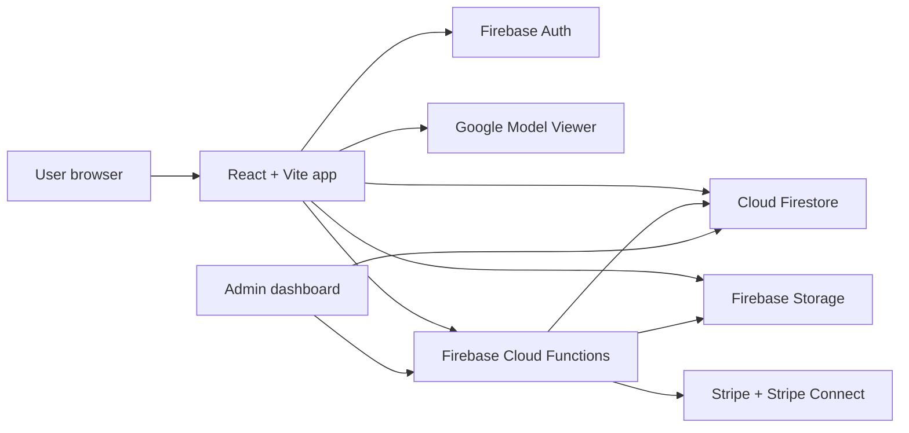

<div align="center">

# 3D Print Dungeon

**A full-stack marketplace and community platform for discovering, uploading, previewing, and selling 3D printable models.**

[Live Demo](https://print-dungeon-3d.web.app/) | [Firebase Mirror](https://print-dungeon-3d.firebaseapp.com/) | [Technical Audit](docs/readme-audit.md) | [Image Guide](docs/images/IMAGE_GUIDE.md)


</div>

> Hero screenshot placeholder: add `docs/images/print-dungeon-hero.png` after capturing the live app. The README avoids referencing missing local images so it does not render broken screenshots.

## Overview

3D Print Dungeon is a React and Firebase marketplace for 3D printable models. It combines model discovery, creator uploads, 3D previews, paid downloads, community discussion, role-based access, and admin tooling in one responsive web app.

The core marketplace, upload, preview, auth, forum, payment, and admin systems are implemented. Some showcase sections, including events, blog posts, collections, printed figures, and a few marketplace subpages, currently use mock or placeholder content.

## Highlights

- **3D model marketplace:** browse models, view details, like/favorite items, follow creators, comment, and download free or purchased files.
- **Interactive previews:** Google Model Viewer integration with lazy loading, posters, progress states, fullscreen behavior, and render galleries.
- **Creator upload flow:** multi-step upload for model files, render images, categories, descriptions, tags, AI labeling, and free/paid pricing.
- **Firebase backend:** Authentication, Firestore, Storage, Hosting, security rules, indexes, emulators, and Firebase Cloud Functions.
- **Stripe payments:** Stripe.js checkout flow, PaymentIntent creation, purchase recording, and Stripe Connect seller onboarding.
- **Community forum:** categories, threads, replies, user thread management, search, and moderation-aware rules.
- **Admin dashboard:** user role management, content moderation, site settings, analytics, maintenance mode, and admin utilities.
- **Responsive UI:** Vite, React, TypeScript, Tailwind CSS, feature-based structure, and optimized production build chunks.

## Tech Stack

| Area | Stack |
| --- | --- |
| Frontend | React 19, TypeScript, Vite 6, Tailwind CSS 4 |
| Routing and state | React Router 7, TanStack React Query, React Context providers |
| Backend | Firebase Authentication, Firestore, Storage, Hosting, Cloud Functions |
| Payments | Stripe.js, React Stripe.js, Stripe Node SDK, Stripe Connect |
| 3D rendering | Google Model Viewer, Three.js conversion utilities |
| Testing and quality | Vitest, React Testing Library, jsdom, ESLint |
| Deployment options | Firebase Hosting/Functions, Docker, Nginx |

## Architecture



The frontend is organized around feature modules under `src/features`, with shared providers for auth, models, search, forum, modals, cookies, maintenance/system alerts, and notifications. Server-side behavior lives in Firebase Cloud Functions, while Firestore and Storage rules protect user data, model data, payments, and admin-only actions.

<details>
<summary>Core user flow</summary>

1. A user signs in with Firebase Authentication.
2. Creators upload model files, render images, metadata, categories, and pricing.
3. Model assets are stored in Firebase Storage and metadata is written to Firestore.
4. STL/OBJ files can be converted to GLB for web preview.
5. Visitors browse, search, preview, like, follow, comment, and join forum discussions.
6. Paid purchases go through Stripe and Firebase Cloud Functions.
7. Admin users manage roles, content reports, settings, analytics, and maintenance mode.

</details>

## Feature Status

| Area | Status |
| --- | --- |
| Authentication and profiles | Implemented |
| Model upload and detail pages | Implemented |
| 3D preview experience | Implemented |
| Likes, follows, comments | Implemented |
| Stripe payment flow | Implemented with production caveats |
| Stripe Connect onboarding | Implemented/partial |
| Search and filters | Implemented/partial sorting |
| Forum | Implemented with a known view-count rules caveat |
| Admin dashboard | Implemented |
| Notifications | Implemented/partial |
| Marketplace subpages | Mixed: featured is partial, new arrivals and best sellers are placeholders |
| Events, blog, collections, printed figures | Mock/static/placeholder content |

For a detailed verification pass, see [docs/readme-audit.md](docs/readme-audit.md).

## Local Development

<details>
<summary>Run the app locally</summary>

```bash
npm install
npm run dev
```

Common commands:

```bash
npm run build
npm run preview
npm run type-check
npm run lint
npm test
```

Firebase emulator commands:

```bash
npm run firebase:emulators-start
npm run firebase:emulators
```

Functions commands:

```bash
cd functions
npm install
npm run serve
npm run deploy
npm run logs
```

</details>

<details>
<summary>Environment and secret names</summary>

Frontend:

```bash
VITE_STRIPE_PUBLISHABLE_KEY=...
```

Firebase local config files:

```text
src/keys/firebase_key.json
src/keys/service_key.json
```

These key files are ignored by Git. Example files are tracked in `src/keys`.

Firebase Functions secrets:

```bash
STRIPE_SECRET_KEY=...
STRIPE_WEBHOOK_SECRET=...
```

</details>

## Validation

Last verified during documentation audit:

| Command | Result |
| --- | --- |
| `npm run build` | Passed |
| `npm run type-check` | Passed |
| `npm run lint` | Failing: existing ESLint errors/warnings |
| `npm test -- --run` | Failing: empty test suites and Firebase duplicate-app setup issue |

The failures are pre-existing quality issues documented in the audit; this README update is documentation-only.

## Screenshots

Screenshots are intentionally not embedded until real image files are added. See [docs/images/IMAGE_GUIDE.md](docs/images/IMAGE_GUIDE.md) for recommended filenames and capture guidance.

Suggested first screenshots:

- `docs/images/print-dungeon-hero.png`
- `docs/images/model-details.png`
- `docs/images/upload-flow.png`
- `docs/images/search-results.png`
- `docs/images/admin-dashboard.png`

## Portfolio Notes

This project demonstrates full-stack product engineering across Firebase infrastructure, TypeScript React architecture, serverless payment workflows, media upload handling, role-based access, 3D model previewing, community features, and admin operations.

A shorter CV description:

> 3D model marketplace built with React, TypeScript, Vite, Firebase, Cloud Functions, Firestore, Google Model Viewer, Stripe, and Vitest, featuring auth, uploads, 3D previews, search, payments, forums, admin tools, and responsive UI.

## Author

Add your portfolio, GitHub, LinkedIn, and contact links here.
